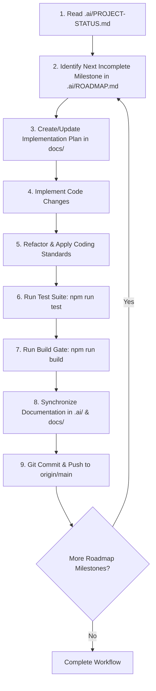

# AI Agent Execution Workflow — MigrationOS

**Scope**: Mandatory step-by-step operating protocol for any AI assistant or coding agent executing tasks in the MigrationOS repository.

---

## 1. Execution Workflow Sequence

---

## 2. Mandatory Step Details

1. **Inspect Context**: Read `.ai/PROJECT-STATUS.md` and `.ai/ROADMAP.md` before starting work. Do not repeat audits of completed milestones.
2. **Identify Target Task**: Select the first incomplete or unblocked milestone.
3. **Implement Cleanly**: Apply small, coherent code changes adhering to `.ai/CODING-STANDARDS.md` and `.ai/SECURITY-POLICY.md`.
4. **Execute Verification Gates**: Run and verify all 4 gates:
   - `npm run lint`
   - `npm run typecheck`
   - `npm run test`
   - `npm run build`
5. **Update Documentation**: Log changes in `.ai/PROJECT-STATUS.md`, `.ai/CHANGELOG.md`, and relevant feature reports.
6. **Commit and Push**: Create descriptive commit messages and push cleanly to `main`.
7. **Continue Automatically**: Proceed directly to the next milestone.

---

## 3. Allowed Stop Conditions

An AI agent MUST stop execution ONLY when encountering one of the following explicit conditions:
1. **Missing External Credentials**: Live accounts required for testing external APIs (e.g. IMAP credentials, Gmail tokens, Graph API keys).
2. **OAuth App Registration**: Third-party portal actions requiring human administrative credentials (e.g. Google Cloud Console / Azure Portal OAuth app creation).
3. **Explicit Production Approval**: Deployments to live production environments requiring human signoff.
4. **Destructive Actions**: Requests requiring dropping live databases or deleting unrecoverable external resources.
5. **Total Roadmap Completion**: All milestones in `.ai/ROADMAP.md` are 100% completed and verified.
