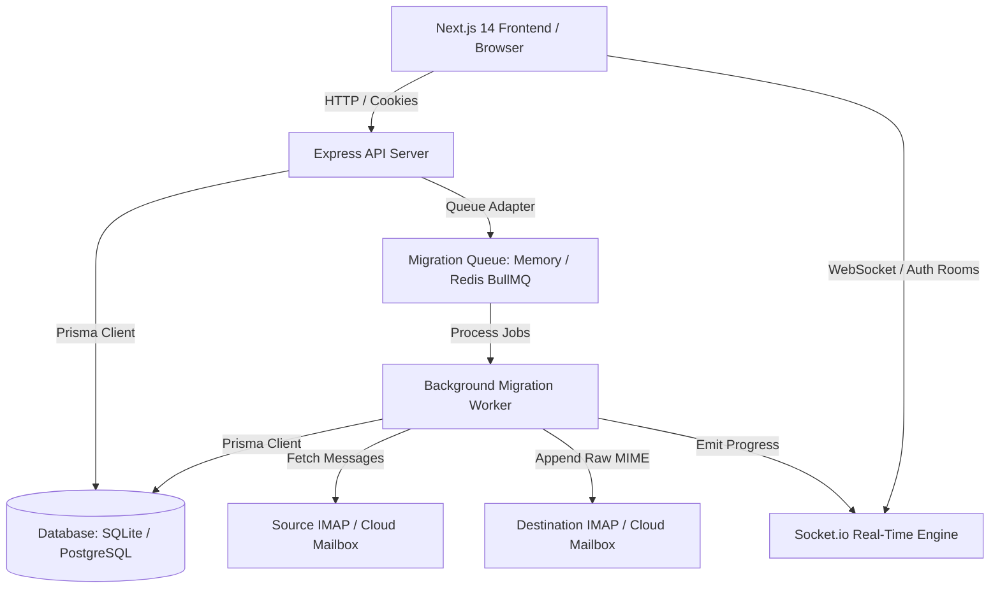

# System Architecture — MigrationOS

**Last Updated**: July 27, 2026  
**Architecture Type**: Multi-Tenant Cloud-Native Micro-SaaS Monorepo  

---

## 1. Monorepo & Directory Structure

MigrationOS uses an NPM workspaces monorepo containing application workspaces and shared packages:

```
migration-os/
├── .ai/                       # AI Operating System & Project Memory
├── apps/
│   ├── api/                   # Express.js REST API & Background Worker Engine
│   │   ├── prisma/            # Database schema & migrations
│   │   └── src/
│   │       ├── config/        # Environment validation (Zod)
│   │       ├── connectors/    # Provider connectors (IMAP, Google, Microsoft)
│   │       ├── middleware/    # Auth & RBAC middleware
│   │       ├── queues/        # Queue abstraction & BullMQ adapter
│   │       ├── routes/        # Express REST API routes
│   │       ├── types/         # Universal data interfaces
│   │       ├── utils/         # Crypto, DB, logger, idempotency
│   │       └── workers/       # Background migration worker execution loop
│   └── web/                   # Next.js 14 App Router Frontend
│       └── src/app/           # Dashboard & UI pages
├── docs/                      # Architectural & verification documentation
├── docker-compose.yml         # Container orchestration (Postgres, Redis, API, Web)
└── package.json               # Root monorepo workspace configuration
```

---

## 2. High-Level System Architecture



---

## 3. Core Component Architecture

### A. Authentication & Session Boundary
- **User Passwords**: Salted hashes generated via Node built-in `crypto.scryptSync`.
- **Session Tokens**: 64-character random hex strings stored in `Session` table with 7-day expiry.
- **HTTP-Only Cookies**: Tokens issued in `auth_token` cookies with `httpOnly: true`, `sameSite: 'lax'`.
- **Middleware**: `authenticateSession` validates sessions and populates `req.user`, `req.session`, `req.organizationId`.

### B. Multi-Tenancy & RBAC Model
- **Tenant Scoping**: All operational tables (`Migration`, `FolderMapping`, `MigratedItem`, `MigrationCheckpoint`, `MigrationLog`, `AuditLog`) contain an `organizationId` foreign key.
- **IDOR Protection**: Database queries strictly filter by `{ id: req.params.id, organizationId: req.organizationId }`. Requests targeting another tenant's records return `404 Not Found`.
- **Roles**:
  - `owner`: Full organization & member management.
  - `admin`: Member management, migration creation/deletion, credential updates.
  - `operator`: Migration creation, connection testing, start/pause/resume/cancel.
  - `viewer`: Read-only access to dashboard, logs, checkpoints, metrics.

### C. Migration Worker & Reliability Engine
- **Idempotency Engine**: Generates unique SHA-256 keys (`migrationId:folder:sourceId:internetMsgId:size:date`). Skips duplicate items during repeat/resume runs.
- **Checkpoint Resumption**: Persists `lastProcessedUid` cursor per folder batch in `MigrationCheckpoint`. Resumes processing from cursor upon restart or failure.
- **Signal Control & Graceful Shutdown**: `SIGTERM`/`SIGINT` handlers yield active message loops, flush database writes, and close queue connections.

### D. Real-Time Socket.io Architecture
- **Tenant Room Isolation**: Sockets authenticate on handshake and join `org:${organizationId}`.
- **Migration Subscriptions**: Sockets subscribe to `migration:${organizationId}:${migrationId}` only after authorizing tenant ownership.
