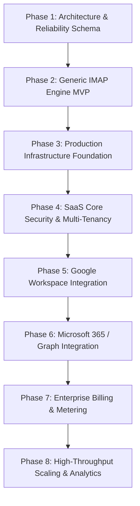

# Platform Roadmap — MigrationOS

**Last Updated**: July 27, 2026  
**Project Goal**: Build an enterprise-grade, multi-tenant, cloud-native Email & Workspace Migration Platform.

---

## Roadmap Phases & Milestones

---

## Detailed Milestone Specifications

### Phase 1: Core Architecture & Reliability Schema (Completed)
- [x] Monorepo workspace structure (`apps/api`, `apps/web`, `packages/*`).
- [x] Prisma database schema with 11 reliability models.
- [x] AES-256-GCM credential encryption module.
- [x] Idempotency key generation module (SHA-256).

### Phase 2: Generic IMAP Engine MVP (Completed)
- [x] `ImapConnector` using `imapflow` for authentication, folder discovery, and message listing.
- [x] Raw MIME message import contract with flag and internal date preservation.
- [x] Folder mapping proposer and delimiter translation (`.` &rarr; `/`).
- [x] Batch UID pagination and checkpoint resumption.

### Phase 3: Production Infrastructure Foundation (Completed)
- [x] PostgreSQL database provider compatibility (`DATABASE_PROVIDER`).
- [x] Redis & BullMQ queue adapter (`QUEUE_PROVIDER`) with dead-letter queue (DLQ).
- [x] Worker hardening with graceful shutdown signal handlers (`SIGTERM`/`SIGINT`).
- [x] Zod environment validation (`env.config.ts`) and structured JSON logger (`logger.ts`).
- [x] Multi-container Docker Compose specification (`PostgreSQL 16`, `Redis 7`, `API`, `Web`).

### Phase 4: SaaS Core Security & Multi-Tenancy (Completed)
- [x] User identity with salted `scrypt` password hashing.
- [x] Session management with HTTP-Only SameSite cookies.
- [x] Organization & OrganizationMembership models with RBAC (`owner`, `admin`, `operator`, `viewer`).
- [x] Mandatory tenant ownership (`organizationId`) across all models and API endpoints.
- [x] Socket.io connection authentication and tenant room isolation (`org:${id}`).
- [x] 11 automated multi-tenant security and IDOR isolation tests.

### Phase 5: Google Workspace Connector Completion (Next Milestone)
- [ ] Implement Google OAuth2 authentication flow and refresh token management.
- [ ] Complete `GoogleConnector` using `googleapis` (Gmail API / Google Drive / Calendar).
- [ ] Support batch Gmail message insertion (`users.messages.insert` / `import`).
- [ ] Handle Google API rate limits (exponential backoff & quota error handling).

### Phase 6: Microsoft 365 / Exchange Connector Completion (Upcoming)
- [ ] Implement Microsoft Entra ID (Azure AD) OAuth2 flow.
- [ ] Complete `MicrosoftConnector` using `@microsoft/microsoft-graph-client`.
- [ ] Support Graph API email import (`/users/{id}/messages`).
- [ ] Handle Graph API throttling (`429 Too Many Requests` & `Retry-After` headers).

### Phase 7: Enterprise Billing & Metering (Upcoming)
- [ ] Stripe integration for subscription plans (Free, Pro, Enterprise).
- [ ] Per-mailbox & GB data migration usage metering.
- [ ] Tiered feature gating (concurrency limits, connector restrictions).

### Phase 8: High-Throughput Scaling & Advanced Analytics (Upcoming)
- [ ] Multi-worker process cluster scaling.
- [ ] Real-time bandwidth and migration throughput analytics dashboards.
- [ ] Automated email report delivery upon migration completion.
